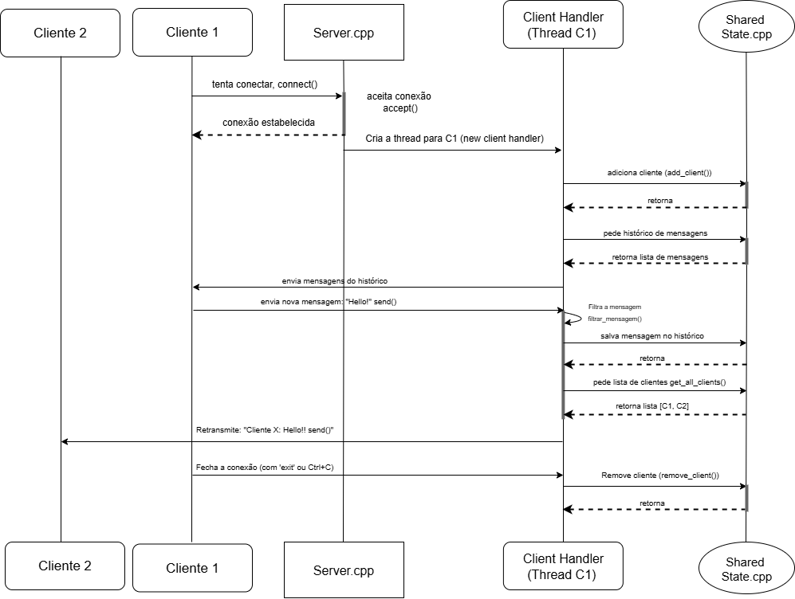

# Servidor de Chat Multiusuário em C++ (LPII -Etapa Final)

## Funcionalidades Implementadas
* **Filtro de Palavras:** Um filtro de palavras proibidas, carregado de um arquivo `forbidden_words.txt`, censura mensagens antes de serem distribuídas.
* **Logging Thread-Safe:** Eventos importantes do servidor (conexões, desconexões, mensagens) são registrados em um arquivo de log de forma segura.
```
LPII-projeto-final/
|
|-- bin/              # Contém os executáveis compilados e arquivos de log
|-- build/            # Contém os arquivos objeto (.o) temporários da compilação
|-- include/          # Contém os arquivos de cabeçalho (.hpp)
|   |-- chat/
|   `-- utils/
|-- src/              # Contém os arquivos de implementação (.cpp)
|   |-- chat/
|   |-- utils/
|   `-- main.cpp
|-- scripts/          # Contém scripts para automação de testes
|-- forbidden_words.txt # Arquivo de configuração do filtro de palavras
|-- Makefile          # Arquivo de build para compilação
`-- README.md
```
## Diagrama de Sequência

O diagrama abaixo ilustra o fluxo de comunicação para os cenários de conexão de um cliente com um servidor, 
usando como exemplo uma mensagem:


## Mapeamento Requisitos → Código

* **Requisito 1: Servidor TCP concorrente aceitando múltiplos clientes.**
    * **Mapeamento:** Implementado na classe `Server`, método `run()`. O servidor entra em um loop `while(true)` que aguarda em `accept()`. Para cada nova conexão, uma `std::thread` é criada para executar um objeto `ClientHandler`, permitindo que o servidor aceite novos clientes concorrentemente.

* **Requisito 2: Cada cliente atendido por thread; mensagens retransmitidas para os demais (broadcast).**
    * **Mapeamento:** A lógica de atendimento é encapsulada na classe `ClientHandler`. O método `handle_client()` recebe mensagens de um cliente e implementa o broadcast chamando `shared_state.get_all_clients()` para obter a lista de destinatários e enviando a mensagem em um loop.

* **Requisito 3: Logging concorrente de mensagens (usando libtslog).**
    * **Mapeamento:** A biblioteca `libtslog` é representada pela classe `Logger`, que utiliza o padrão Produtor-Consumidor. Múltiplas threads `ClientHandler` chamam o método `log()` de forma segura (protegido por `std::mutex`) para enfileirar mensagens, enquanto uma única thread interna (`writer_thread_func`) escreve no arquivo.

* **Requisito 4: Cliente CLI: conectar, enviar/receber mensagens.**
    * **Mapeamento:** Implementado na classe `Client`. O método `run()` cria duas threads: `send_messages()` para ler a entrada do usuário (`std::getline`) e `receive_messages()` para aguardar dados do servidor (`recv()`), permitindo comunicação simultânea.

* **Requisito 5: Proteção de estruturas compartilhadas (lista de clientes, histórico).**
    * **Mapeamento:** A proteção é realizada pela classe `SharedState`. Todos os métodos que acessam os dados compartilhados (`clients` e `message_history`) utilizam um `std::lock_guard<std::mutex>` para garantir exclusão mútua e prevenir condições de corrida.

### Como Compilar e rodar o projeto

## Pré-requisitos
* Compilador C++17 ou superior (g++)
* `make`
* Biblioteca `pthread`

1.  **Compilar o projeto:**
    A partir da pasta raiz, execute:
    ```bash
    make
    ```

2.  **Iniciar o Servidor:**
    Em um terminal, execute:
    ```bash
    ./bin/chat_app server <porta>
    ```
    Exemplo: `./bin/chat_app server 8080`

3.  **Iniciar um Cliente Interativo:**
    Em um novo terminal, execute:
    ```bash
    ./bin/chat_app client <ip_do_servidor> <porta>
    ```
    Exemplo: `./bin/chat_app client 127.0.0.1 8080`

4.  **Limpar arquivos compilados:**
    ```bash
    make clean
    ```

### Simulação de Múltiplos Clientes (Teste de Carga)

Um script está disponível para simular múltiplos clientes automáticos (não-interativos).

1.  Com o servidor rodando, abra um novo terminal.
2.  Execute o script:
    ```bash
    ./scripts/test_clients.sh
    ```
```
# Obs:
    Ao fechar o server com uma porta, o windows não vai fechar a porta imediatamente, então pode ser que o usuário não consiga criar um servidor com a mesma porta antes de um tempo de espera (entre 30 - 180 segundos)
